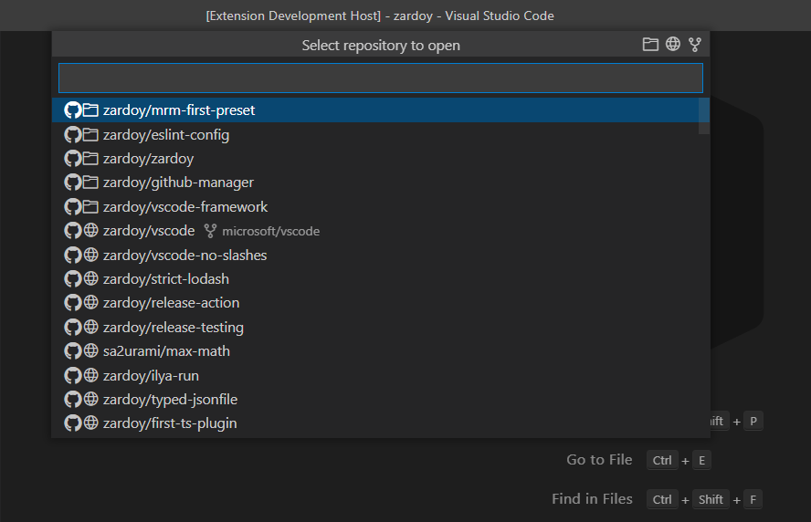
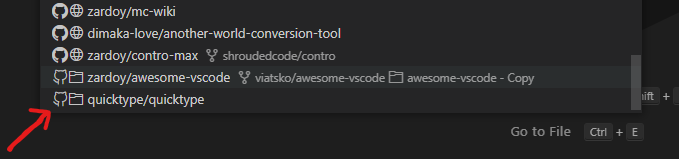
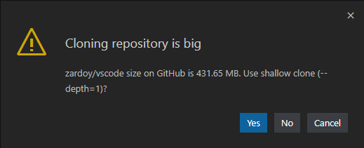
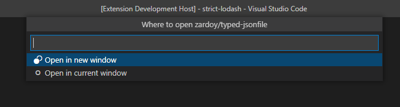

# GitHub Manager

- Fast integration with GitHub without any caching
- Highly configurable. A lot of sorting settings
- Syncable history of recently opened repos

There are two main commands: `Open GitHub Repository...` and `Open Cloned GitHub Repository...`. Both are using sync-ignored setting as path to directory where all your cloned repositories live (more below). The first command uses integration with your GitHub account and lists all remote and cloned repos (I call it *remote* command). Here is an example:



Here, repository entries that have folder icon are cloned and available offline. If you select one of them, new VSCode window with repository will be opened.

Repos that have *globe* icon, are obviously not cloned. If you select one of them, repo will be cloned to your *default clone directory*.

Cloned repos that are not listed as your GitHub repo have different octokit icon:



> Note 1: It uses `repo` scope with authentication, but only to read list of your private repos.
> Note 2: This extension won't detect repos names, they will just appear on bottom. If you know that some of your repositories were renamed (or their ownership were changed) use [rename-repos](https://github.com/zardoy/rename-repos)'s script to update *origins*.
> Note 3: if you have repos with the same origin, (perhaps you duplicated cloned directory repository), only first (random) one will be shown as yours and another one will be shown as foreign. It's recommended to remove duplicated directories in these cases.

When cloning repository, if its' size is over *50 MB*, you will see this dialog:



Also, you have 3 buttons to the right of title (*Select repository to open*). Select desired repository with arrow keys (it's not possible with mouse) and click:

- Folder icon: to reveal cloned repo in Explorer/Finder
- Globe icon: to open main GitHub repository page

And there is one global button, that toggles visibility of forks, that have 3 states: visible (*default*), only or hidden.

---

But your primary command will be `Open Cloned GitHub Repository...` as it is fast and doesn't require internet connection. It is like the command above, but doesn't display remote repos (those with globe icon).

You can even use this extension freely without authentication (or even forcefully disable authentication via setting).

---

- This extension is similar to [Project Manager extension](https://marketplace.visualstudio.com/items?itemName=alefragnani.project-manager), but the latter is a more comprehensive extension for working with git dirs (tags, bookmarks and so on...)

## Open Location

Extension always tries to reuse empty windows. But if windows isn't empty (have tabs or opened workspace), folder will be opened in new window by default.

You change this via setting `githubManager.whereToOpen` to `ask(after)`, so whenever windows is not empty extension will ask you where to open the directory:



## Source of Truth

- This extension uses `git.defaultCloneDirectory` underneath from which it gets cloned repos, it is sync-ignored by default. However you don't need to specify the path manually, just use the button from error notification.

## Sorting

Here is how we apply sorting for repository entries.

### Recently Opened

Recently opened repos will appear on top for all commands. You can disable it by setting `githubManager.boostRecentlyOpened` to `false`

### For Cloned

For commands that have `cloned` in title, we apply sorting by count of respos of owner and then by name of repo.
In other words, repos of owner that have most repos will appear on top.

### For Remote

For commands that don't have `cloned` in title, we apply sorting according to `githubManager.onlineRepos.sortBy` setting.
We don't apply sorting for repos that you don't have access.

## Command Arguments

- Every open command:
  - `owner` to display repos only from that user (but note, that user still can be ignored)
  - `showForks` Initial state of *toggle forks visibility* button. Can be: `false` (default), `true` or `"only"`
- For `githubManager.openGithubRepository`: `notClonedOnly: true` to display only not-cloned repos that

Example:

```json
{
    "key": "<someKey>",
    "command": "githubManager.openGithubRepository",
    "args": {
        "notClonedOnly": true,
        "owner": "some-crap",
        "showForks": "only"
    }
}
```

It would show only forked not-cloned repos that you have access to (perhaps collaborator).

## Open at GitHub

This is a command for opening current cloned repository at GitHub, in multi-root workspaces you have to select folder (cloned GitHub repo).

This command receives arguments: `path`, `remoteName` (defaults to `origin`)

### About the Icon

Initially I wanted to use GitHub icon with Project Manager icon background, however I presume I [can't use it](https://github.com/logos) in my "products".
So I picked [repo-push Octicon](https://github.com/primer/octicons/blob/main/icons/repo-push-24.svg)

### Other Ideas

I didn't find use cases for them, however if you need something, please open an issue:

- custom repository render template? (I don't really need it)
- allow other remoteName (defaults to origin) (From which origin extract repository url)
